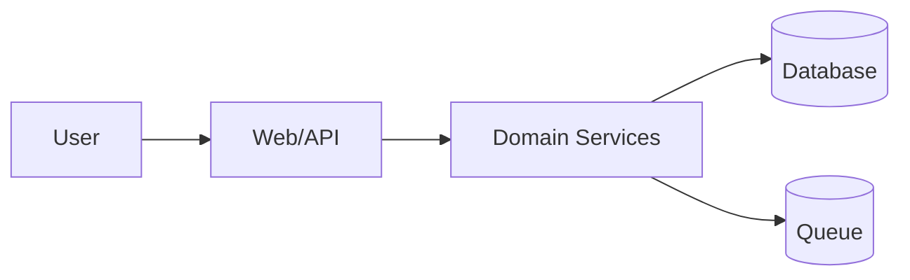

# Stewardship Standards

Use these standards to keep projects maintainable and prevent architecture rot.

## Default Architecture Shape

For non-trivial software, default to a modern layered and modular design. Adapt names to the project's stack, but keep responsibilities distinct:

- **Presentation / entrypoints**: UI, HTTP routes, CLI commands, workers, or message handlers. They translate inputs/outputs and should not own core business rules.
- **Application / use cases**: orchestrate workflows, transactions, policies, and calls across domain services and ports.
- **Domain / business logic**: encode core rules, invariants, entities/value objects, and decisions independent of frameworks and vendors where practical.
- **Infrastructure / adapters**: implement ports for databases, APIs, queues, filesystems, model providers, browsers, and other external systems.
- **Persistence / integration schemas**: keep data contracts, migrations, and external API shapes explicit and documented.

Design targets:

- High cohesion inside modules; low coupling between modules.
- Stable interfaces at boundaries; implementation details hidden behind adapters where useful.
- Dependency direction should point inward toward stable domain/application abstractions, not outward toward UI/framework/vendor code.
- Each new module should have an obvious owner, responsibility, public surface, tests, and documentation entry.
- Project directories should reveal ownership. Do not let source, tests, scripts, configs, assets, docs, packages, or root folders become undifferentiated piles of unrelated files.
- Avoid both extremes: no god files/spaghetti, but also no empty ceremonial layers for tiny scripts.

Documentation target:

- Maintain `docs/architecture.md` and/or `docs/project-map.md` as factual navigation maps of current code. Future agents should be able to identify the relevant layer/module from docs first, then inspect only the needed implementation files.

## Anti-Sprawl Rules

Prefer existing structure over novelty:

- Search for similar features before creating new modules.
- Reuse established naming, layering, error handling, and testing patterns.
- Add a new abstraction when it removes duplication, clarifies a boundary, defines a stable contract, or prevents cross-layer coupling; avoid abstractions that are only decorative.
- Avoid `misc`, `utils`, `helpers`, and `common` dumping grounds unless the project already has disciplined conventions for them.
- Split folders by real responsibility when the project already has distinct features, layers, adapters, providers, protocols, domains, artifact types, or verification scopes.

Keep boundaries clear:

- UI should not secretly own business rules.
- Domain logic should not depend on presentation details.
- Infrastructure adapters should be replaceable where practical.
- Cross-module dependencies should be intentional, documented, and routed through explicit interfaces/contracts when the boundary is significant.

Control dependencies:

- Do not add a package/service/framework just because it is convenient.
- Check existing dependencies first.
- Document why a new dependency is needed, alternatives considered, and removal cost.

Make failure visible:

- Handle errors according to project conventions.
- Avoid swallowing exceptions or returning ambiguous null/empty values.
- Add logs/telemetry only where useful and non-sensitive.

## Project Structure Standards

Use the repository's existing structure first. If it is absent or already turning into a flat pile, introduce a small, explicit project tree that matches the project's scale.

Good project structure makes these questions answerable from filenames and folders:

- What kind of artifact is this: source, test, script, config, asset, doc, generated output, migration, or tool?
- What layer, feature, bounded context, provider, protocol, or adapter owns it?
- Where are its tests, fixtures, contracts, schemas, generated artifacts, and docs?
- Which areas are stable domain/application logic and which areas are framework/vendor/I/O glue?

Common patterns:

```text
<source-root>/
  presentation/ or routes/ or ui/
  application/ or use-cases/
  domain/
  infrastructure/ or adapters/
  persistence/ or schemas/
  shared/ or kernel/
tests/
  unit/
  integration/
  e2e/
scripts/ or tools/
config/
docs/
```

Feature-oriented projects may instead use:

```text
<source-root>/
  features/<feature>/
    presentation/
    application/
    domain/
    infrastructure/
  shared/
tests/<feature>/
docs/<feature>/
```

Rules:

- Prefer folders with clear ownership over flat project dumps.
- Keep tests, fixtures, scripts, configs, docs, assets, generated outputs, and migrations discoverable by responsibility and lifecycle.
- Keep tests near the changed behavior or mirror the project/code structure according to project convention.
- Keep cross-cutting shared/common/utils/tooling areas small, named, and documented; do not use them as parking lots.
- Add a folder when it groups at least one real responsibility boundary or prevents foreseeable mixing; avoid empty ceremonial folders.
- When moving files, preserve public imports through compatibility shims or migration notes if callers would otherwise break.

## Code Comment Standards

Code comments are part of project stewardship. Documentation outside the code is not enough when the most precise fact lives next to a module boundary, branch, invariant, protocol translation, migration, or workaround.

Treat comments as code-local contracts, not decoration. A useful comment explains what a future maintainer cannot safely infer from names, types, tests, or surrounding structure.

### Inline And Local Comments

Write inline or block comments for:

- domain invariants and business rules that are not obvious from names;
- why an unusual branch, fallback, retry, timeout, ordering, cache, or validation exists;
- external API quirks, protocol constraints, data-shape assumptions, and version compatibility;
- concurrency, transaction, idempotency, security, privacy, performance, or resource-lifetime constraints;
- non-trivial algorithms, parsing, serialization, migrations, and lossiness;
- temporary workarounds, feature flags, compatibility shims, and removal conditions;
- public interfaces where callers need contract, side-effect, error, or lifecycle expectations.

Place these comments immediately above the branch, transformation, invariant check, adapter call, query, migration step, or workaround they explain. Keep them close enough that code review naturally updates them with the code.

### Function, Class, And Interface Docs

Use function/class/interface docstrings when callers need more than a name and type signature:

- purpose and responsibility;
- parameters whose meaning is domain-specific;
- return value semantics, especially empty/null/error cases;
- side effects, I/O, transactions, retries, caching, idempotency, or lifecycle ownership;
- exceptions/errors and retryability;
- thread/concurrency, async ordering, security, privacy, or performance constraints;
- compatibility or migration behavior.

Do not write docstrings for every trivial private helper if the signature and body are already clear.

### Module And File Header Comments

Use a module/file header comment when the file is a meaningful unit of architecture or operation, especially for:

- entrypoints, routes, workers, CLIs, jobs, scripts, and migrations;
- domain modules with important invariants;
- application/use-case orchestration modules;
- infrastructure adapters for databases, queues, filesystems, browsers, model providers, or external APIs;
- public API/client modules, SDK surfaces, schemas, or generated-code boundaries;
- complex tests or fixtures where the scenario design is not obvious;
- compatibility shims, feature-flagged paths, or temporary migration bridges.

A good module/file header says only what helps maintainers use or change the file safely:

- responsibility: what this file owns;
- non-goals: what it deliberately does not own;
- layer/bounded context and dependency direction;
- main public entrypoints/exports;
- key invariants, data ownership, transaction or lifecycle rules;
- external systems, protocols, generated status, or edit policy;
- security, privacy, concurrency, idempotency, performance, or operational constraints;
- links to ADRs/specs/runbooks when the reason lives outside the code.

Avoid mandatory headers on trivial re-exports, tiny configuration files, obvious component wrappers, or generated files that already carry generated metadata. Do not use file headers as changelogs, author/date stamps, duplicated README text, or a place to justify poor structure.

Language-neutral shape:

```text
<module/file header>
Responsibility: <what this file owns>
Boundary: <layer/context and what must not leak in/out>
Contracts: <important invariants, side effects, errors, lifecycle, data ownership>
External constraints: <API quirks, generated status, security/performance/concurrency constraints>
References: <ADR/spec/runbook links if useful>
</module/file header>
```

Avoid comments that:

- restate syntax or repeat the next line in prose;
- describe stale behavior;
- justify poor structure instead of fixing it;
- hide secrets, private data, or sensitive operational details.

When changing code near an existing comment, update or remove stale comments in the same slice. A stale comment is a bug in project understanding.

## Patch Vs Redesign

Do not keep stacking patches when the local design is the problem. A patch is appropriate when the defect is isolated, the module ownership is clear, the fix preserves existing contracts, and verification can prove the behavior.

Pause and propose a redesign or local refactor when any of these are true:

- The same bug or edge case has been fixed multiple times.
- Fixes require touching unrelated layers or many files for a small behavior change.
- Ownership is unclear and logic is split across presentation, application, domain, and infrastructure code.
- Invariants contradict each other or are enforced inconsistently.
- Tests are hard to write because the code has hidden dependencies or global state.
- A workaround has become part of the normal path.
- New patches increase complexity more than they reduce risk.

When redesign is warranted:

1. State why another patch is unsafe.
2. Define the desired boundary or invariant.
3. Sketch the smallest migration path that keeps the project working.
4. Add or update tests around the behavior before broad rewrites when practical.
5. Record the decision in a plan, log, ADR, or architecture note depending on impact.
6. Keep the refactor local unless the root cause is truly architectural.

## ADR Triggers

Write an ADR or `DECISIONS.md` entry when any of these are true:

- New framework, database, queue, cache, external service, or major library.
- Public API/CLI/protocol contract change.
- Data model or migration strategy with long-term impact.
- Authentication, authorization, encryption, or permission model change.
- Deployment topology or runtime model change.
- Cross-cutting refactor or architectural boundary change.
- A tradeoff was debated or future maintainers may ask why.

Skip ADR for:

- Trivial bug fixes.
- Pure formatting.
- Obvious local implementation details.
- Decisions already documented in an existing ADR/spec.

## Code Review Checklist

Before final delivery, check:

### Context

- Did you read project instructions and nearby code?
- Did you identify existing patterns?
- Did you avoid contradicting existing docs/specs?

### Design

- Is the change the smallest maintainable solution that still preserves good layering?
- Are layers, module boundaries, and responsibilities clear?
- Are cross-boundary interfaces/contracts explicit enough for future changes?
- Is there unnecessary duplication?
- Is any new dependency justified?
- Are naming and file placement consistent?
- Does project structure avoid catch-all directories and reveal ownership/layer/feature/artifact boundaries?
- Do comments, docstrings, and module/file headers explain non-obvious intent, responsibilities, invariants, constraints, risks, and public contracts?
- Did changed code update stale nearby comments?
- If this area has been patched repeatedly, did you assess redesign/refactor instead of adding another patch?

### Documentation

- Did README/docs/specs change when behavior changed?
- Did architecture docs or diagrams change when boundaries changed?
- Did you record non-obvious decisions?
- Did you log important discoveries/risks?
- Are stable facts, decision facts, process facts, and agent execution state stored in their canonical locations?

### Verification

- Are tests added/updated near changed behavior?
- Were relevant checks run?
- Are unverified areas explicit?
- Is rollback or mitigation clear for risky changes?

### Git State

- Was `git status --short --branch` checked before non-trivial edits?
- Are existing dirty files understood and protected?
- Are commits small, verified, and reviewable?
- Are staged files limited to intentional changes?
- Is rollback possible without losing unrelated work?

### Continuity

- Can a future human or agent find the project root, Git branch/status, plan, logs, docs, ADRs, and next step without reading the whole chat?
- Are project-specific facts stored in the project rather than only in global memory?
- Does any handoff separate facts, assumptions, decisions, blockers, and verification?
- Does any handoff point to canonical files instead of being the only copy of stable facts or decisions?

## Architecture Diagram Expectations

Use diagrams to clarify, not decorate.

Good diagrams:

- Show real boundaries and dependencies.
- Match current code, not aspirational architecture.
- Are stored as text when possible.
- Include a short explanation of what the diagram omits.

Recommended Mermaid example:



Use ordinary Mermaid `flowchart` syntax unless the project already supports C4 Mermaid or PlantUML.
