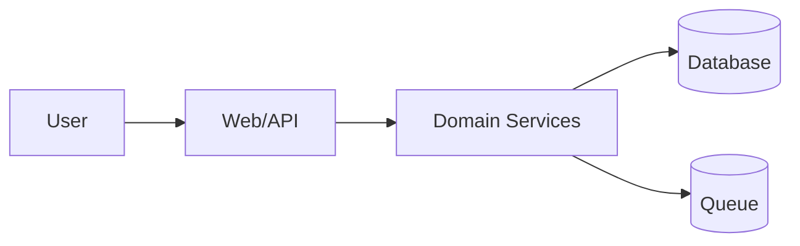

# Stewardship Standards

Use these standards to keep projects maintainable and prevent architecture rot.

## Default Architecture Shape

For non-trivial software, default to a modern layered and modular design. Adapt names to the project's stack, but keep responsibilities distinct:

- **Presentation / entrypoints**: UI, HTTP routes, CLI commands, workers, or message handlers. They translate inputs/outputs and should not own core business rules.
- **Application / use cases**: orchestrate workflows, transactions, policies, and calls across domain services and ports.
- **Domain / business logic**: encode core rules, invariants, entities/value objects, and decisions independent of frameworks and vendors where practical.
- **Infrastructure / adapters**: implement ports for databases, APIs, queues, filesystems, model providers, browsers, and other external systems.
- **Persistence / integration schemas**: keep data contracts, migrations, and external API shapes explicit and documented.

Design targets:

- High cohesion inside modules; low coupling between modules.
- Stable interfaces at boundaries; implementation details hidden behind adapters where useful.
- Dependency direction should point inward toward stable domain/application abstractions, not outward toward UI/framework/vendor code.
- Each new module should have an obvious owner, responsibility, public surface, tests, and documentation entry.
- Avoid both extremes: no god files/spaghetti, but also no empty ceremonial layers for tiny scripts.

Documentation target:

- Maintain `docs/architecture.md` and/or `docs/project-map.md` as factual navigation maps of current code. Future agents should be able to identify the relevant layer/module from docs first, then inspect only the needed implementation files.

## Anti-Sprawl Rules

Prefer existing structure over novelty:

- Search for similar features before creating new modules.
- Reuse established naming, layering, error handling, and testing patterns.
- Add a new abstraction when it removes duplication, clarifies a boundary, defines a stable contract, or prevents cross-layer coupling; avoid abstractions that are only decorative.
- Avoid `misc`, `utils`, `helpers`, and `common` dumping grounds unless the project already has disciplined conventions for them.

Keep boundaries clear:

- UI should not secretly own business rules.
- Domain logic should not depend on presentation details.
- Infrastructure adapters should be replaceable where practical.
- Cross-module dependencies should be intentional, documented, and routed through explicit interfaces/contracts when the boundary is significant.

Control dependencies:

- Do not add a package/service/framework just because it is convenient.
- Check existing dependencies first.
- Document why a new dependency is needed, alternatives considered, and removal cost.

Make failure visible:

- Handle errors according to project conventions.
- Avoid swallowing exceptions or returning ambiguous null/empty values.
- Add logs/telemetry only where useful and non-sensitive.

## ADR Triggers

Write an ADR or `DECISIONS.md` entry when any of these are true:

- New framework, database, queue, cache, external service, or major library.
- Public API/CLI/protocol contract change.
- Data model or migration strategy with long-term impact.
- Authentication, authorization, encryption, or permission model change.
- Deployment topology or runtime model change.
- Cross-cutting refactor or architectural boundary change.
- A tradeoff was debated or future maintainers may ask why.

Skip ADR for:

- Trivial bug fixes.
- Pure formatting.
- Obvious local implementation details.
- Decisions already documented in an existing ADR/spec.

## Code Review Checklist

Before final delivery, check:

### Context

- Did you read project instructions and nearby code?
- Did you identify existing patterns?
- Did you avoid contradicting existing docs/specs?

### Design

- Is the change the smallest maintainable solution that still preserves good layering?
- Are layers, module boundaries, and responsibilities clear?
- Are cross-boundary interfaces/contracts explicit enough for future changes?
- Is there unnecessary duplication?
- Is any new dependency justified?
- Are naming and file placement consistent?

### Documentation

- Did README/docs/specs change when behavior changed?
- Did architecture docs or diagrams change when boundaries changed?
- Did you record non-obvious decisions?
- Did you log important discoveries/risks?

### Verification

- Are tests added/updated near changed behavior?
- Were relevant checks run?
- Are unverified areas explicit?
- Is rollback or mitigation clear for risky changes?

## Architecture Diagram Expectations

Use diagrams to clarify, not decorate.

Good diagrams:

- Show real boundaries and dependencies.
- Match current code, not aspirational architecture.
- Are stored as text when possible.
- Include a short explanation of what the diagram omits.

Recommended Mermaid example:

Use ordinary Mermaid `flowchart` syntax unless the project already supports C4 Mermaid or PlantUML.

