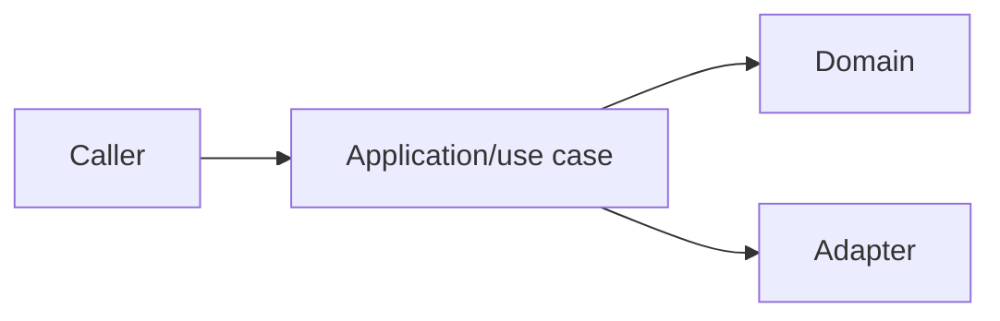

# Project Steward Templates

Use these templates only when they improve project clarity, recovery, or handoff. Keep them short and factual.

## AGENTS.md

```markdown
# Agent Instructions

## Project Scope

- Project root:
- Primary app/package:
- Important subprojects:

## Commands

- Install:
- Test:
- Lint/typecheck:
- Build:
- Run:

## Architecture

- Entry points:
- Application/use-case layer:
- Domain/business logic:
- Infrastructure/adapters:
- Persistence/external services:

## Conventions

- Code style:
- Test style:
- Docs/logs/ADR locations:
- Migration/deployment notes:

## Safety

- Do not:
- Ask before:
- Required verification before delivery:
```

## Run Plan

```markdown
# Plan: <task>

Project: `<absolute project root>`
Run state: `<path>`

## Goal

- User outcome:
- Acceptance criteria:
- Non-goals:

## Context

- Instructions read:
- Existing patterns:
- Affected modules/contracts:

## Slices

1. <slice>
   - Files/modules:
   - Verification:
   - Stop condition:

## Verification

- Targeted:
- Broad:
- Manual:

## Risks

- Risk:
- Rollback:
```

## Log Entry

```markdown
## <timestamp>

- Did:
- Learned:
- Changed files:
- Verification:
- Next:
- Risk/blocker:
```

## ADR

```markdown
# ADR: <decision title>

Date: <YYYY-MM-DD>
Status: proposed | accepted | superseded

## Context

<facts and forces that made the decision necessary>

## Decision

<the chosen direction>

## Consequences

- Positive:
- Negative:
- Follow-up:

## Alternatives Considered

- <alternative and why it was not chosen>
```

## Architecture Note

````markdown
# Architecture: <area>

## Purpose

<what this area owns>

## Boundaries

- Owns:
- Does not own:
- Depends on:
- Called by:

## Contracts

- API/CLI/events/schemas:
- Data models:
- Error handling:

## Diagram



## Verification

- Tests:
- Manual checks:
````

## Handoff

```markdown
# Handoff: <task>

Updated: <timestamp>
Status: active | paused | blocked | verified | complete
Project: `<absolute project root>`

## Current Objective

<one paragraph>

## Completed

- <facts only>

## Current State

- Changed files:
- Important commands:
- Important decisions:

## Next Safest Step

<exact command, file, or action>

## Verification

- Run:
- Result:
- Still needed:

## Risks Or Blockers

- <risk or none>
```

## Blocker Note

```markdown
## Blocker: <short title>

Impact:
Evidence:
Tried:
Safest next action:
Question for user:
```

## Verification Matrix

```markdown
| Area | Check | Result | Notes |
| --- | --- | --- | --- |
| Changed module | `<command>` | pass/fail/not run | |
| Contract/API | `<command or manual check>` | pass/fail/not run | |
| Build/lint/typecheck | `<command>` | pass/fail/not run | |
| UI/manual flow | `<steps>` | pass/fail/not run | |
```

## Final Summary

```markdown
Changed:
- <behavior or files>

Verified:
- `<command>` - <result>

Recorded:
- <run/log/ADR/spec path>

Remaining:
- <risk, TODO, or none>
```
