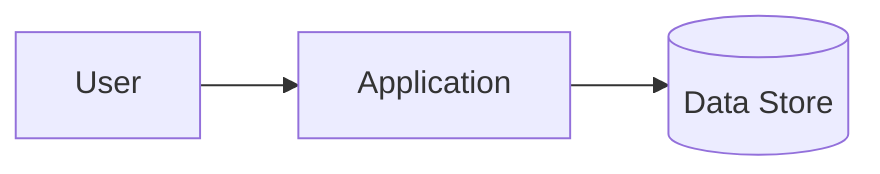

# Project Steward Templates

Copy and adapt these templates. Keep them short unless the project requires detail.

## `AGENTS.md` Template

```markdown
# AGENTS.md

## Project Scope

- Project root:
- Monorepo subproject, if any:

## Project Purpose

- What this project does:
- Non-goals:
- Primary users/systems:

## Required Reading Before Work

1. `README.md`
2. `docs/architecture.md` or `docs/architecture/overview.md`
3. Relevant files under `docs/`, `specs/`, or `.claude/specs/`
4. Nearby source code and tests for the area being changed
5. Recent project-local logs under `logs/` when continuing prior work

## Project Map

- Source roots/packages:
- `tests/...` -
- `scripts/` or `tools/` -
- `config/` -
- `assets/` -
- `docs/...` -

## Project Structure Rules

- Organize the whole project tree by clear layer, feature, bounded context, adapter, provider, artifact type, and verification scope.
- Do not dump unrelated files directly under source, test, script, config, docs, assets, tooling, or root folders when boundaries are clear.
- Keep shared/common/utils/tooling areas small and named by responsibility.
- Keep tests near changed behavior or mirrored by project/code structure.

## Commands

- Install:
- Dev:
- Test:
- Lint/typecheck:
- Build:

## Git Rules

- Default branch:
- Branch naming:
- Commit style:
- PR/review requirements:
- Protected files/paths:
- Multi-agent coordination rule:
- Required Git checks before handoff:

## Architecture Rules

- Default to modern maintainable engineering: layered architecture, modularity, decoupling, explicit interfaces/contracts, and clear abstraction boundaries.
- Follow existing module boundaries; improve unclear boundaries when the change would otherwise spread across unrelated code.
- Create or preserve meaningful folders for presentation, application/use cases, domain, infrastructure/adapters, persistence/schemas, features, tests, scripts/tools, config, docs, assets, and generated files when project scale warrants it.
- Search for similar implementations before adding new modules.
- Do not add dependencies/frameworks without a documented reason.
- Keep public APIs backward-compatible unless explicitly changing them.
- Keep domain/business logic independent from UI, framework, vendor, and infrastructure details where practical.

## Code Comment Rules

- Add comments/docstrings for non-obvious intent, domain invariants, external constraints, edge cases, concurrency, security, performance, migrations, and temporary workarounds.
- Document public interfaces when callers need contract, side-effect, error, or lifecycle expectations.
- Do not add comments that merely restate obvious syntax.
- Update stale nearby comments when changing code.

## Documentation Rules

- Stable facts live in `README.md`, `AGENTS.md`, and `docs/`.
- Decision facts live in `DECISIONS.md` or `docs/adr/`.
- Process facts live in `logs/YYYY-MM-DD.md`.
- Agent execution state lives in `docs/agent-runs/<date-task>/` and must not be the only copy of durable project facts.
- Update README/docs when commands, behavior, APIs, setup, or architecture change.
- Record significant decisions in `docs/adr/` or `DECISIONS.md`.
- Update diagrams when system boundaries or dependencies change.

## Logging Rules

- For non-trivial work, append this project's `logs/YYYY-MM-DD.md` with process facts: plan summary, discoveries, verification, and risks.
- Promote stable facts from logs or agent execution state into README/AGENTS/docs.
- Promote durable decisions from logs or agent execution state into DECISIONS/docs/adr.
- Do not mix logs from other repos/projects managed by the same agent.
- Do not log secrets or sensitive personal data.

## Verification Rules

- Run the narrowest relevant test first.
- Run lint/typecheck/build when touching shared code or before handoff.
- If checks cannot run, explain why and what is unverified.

## Safety Rules

- Ask before destructive migrations, data deletion, deployments, or security posture changes.
```

## Work Plan Template

```markdown
## Plan: <task title>

Date: YYYY-MM-DD
Owner/agent:
Project root:
Subproject:

### Goal

### Context Read

- [ ] `AGENTS.md`
- [ ] `README.md`
- [ ] Relevant docs/specs
- [ ] Nearby code/tests
- [ ] Similar implementations searched

### Git Baseline

- Branch:
- Upstream:
- Dirty files before work:
- Untracked files:
- Unpushed commits:
- User/other-agent changes to preserve:

### Affected Areas

### Layering / Interfaces

- Existing layers/modules involved:
- Interfaces/contracts affected:
- New abstraction needed? Why/why not:
- Project structure/folders affected:
- Code comments/docstrings needed:

### Proposed Steps

1.
2.
3.

### Verification

### Docs/Logs/ADRs to Update

- Stable facts:
- Decision facts:
- Process facts:
- Agent execution state needed? Why/why not:

### Git / Collaboration

- Commit/checkpoint plan:
- Branch/PR plan:
- Rollback plan:
- Multi-agent ownership:

### Risks / Unknowns
```

## Daily Project Log Template

```markdown
# YYYY-MM-DD

## <task title>

Time:
Agent:
Project root:
Subproject:

### Intent

### Context / Discoveries

### Changes

-

### Decision Pointers

- Durable decisions recorded in:
- Summary:

### Fact Placement

- Stable facts promoted to:
- Decision facts promoted to:
- Agent execution state linked, if any:

### Architecture / Interface Notes

- Layers/modules affected:
- Contracts/docs updated:
- Project structure/folders changed:
- Code comments/docstrings added or updated:

### Verification

- Command/result:

### Git State

- Branch:
- Commits:
- Dirty/untracked files:
- Unpushed work:

### Risks / TODO

-

### Handoff Notes

-
```

## ADR Template

```markdown
# ADR YYYY-MM-DD: <decision title>

Status: Proposed | Accepted | Superseded
Date: YYYY-MM-DD

## Context

What problem or force led to this decision?

## Decision

What are we choosing?

## Alternatives Considered

1. Option A - pros/cons
2. Option B - pros/cons

## Consequences

### Positive

### Negative / Tradeoffs

### Follow-up

## References

- Related issue/spec/log:
```

## Redesign / Refactor Plan Template

```markdown
## Redesign / Refactor Plan: <area>

Date: YYYY-MM-DD
Project root:
Subproject:

### Why Another Patch Is Not Enough

- Repeated failures or patches:
- Root cause evidence:
- Risk of continuing to patch:

### Desired Boundary / Invariant

- Ownership:
- Public contract:
- Invariants:

### Migration Steps

1.
2.
3.

### Verification

- Characterization tests before refactor:
- Unit/integration checks:
- Manual smoke checks:

### Rollback / Safety

- Rollback path:
- Feature flag or compatibility shim:

### Docs / ADR Impact

- Docs to update:
- ADR needed? Why/why not:
```

## Architecture Overview Template

````markdown
# Architecture Overview

Last updated: YYYY-MM-DD

## System Purpose

## High-Level Diagram



## Major Components

| Component | Layer | Responsibility | Public contracts/interfaces | Key files |
|---|---|---|---|---|
|  |  |  |  |  |

## Project Structure

- Source roots/packages:
- `tests/...`:
- `scripts/` or `tools/`:
- `config/`:
- `assets/`:
- Generated outputs:
- Shared/common areas:
- Feature or bounded-context folders:

## Layering and Dependency Rules

- Presentation/entrypoints:
- Application/use cases:
- Domain/business logic:
- Infrastructure/adapters:
- Persistence/integration schemas:

## Code Comment Policy

- What must be commented near code:
- Public interface documentation expectations:
- Stale comment cleanup rule:

## Data / Control Flow

## External Dependencies

## Important Invariants

## Known Risks / Tech Debt

## References

- ADRs:
- Specs:
- Runbooks:
````

## Handoff Template

```markdown
## Handoff: <task>

Project root:
Subproject:

### Current State

### What Was Done

### Files Touched

### Verification

### Open Questions

### Git State

- Branch:
- Base commit:
- Current HEAD:
- Dirty/untracked files:
- Unpushed commits:
- PR/remote:

### Next Safe Step
```

## Blocker Note

```markdown
## Blocker: <short title>

Project root:
Subproject:
Impact:
Evidence:
Tried:
Safest next action:
Question for user:
```

## Verification Matrix

```markdown
| Area | Check | Result | Notes |
| --- | --- | --- | --- |
| Changed module | `<command>` | pass/fail/not run | |
| Contract/API | `<command or manual check>` | pass/fail/not run | |
| Build/lint/typecheck | `<command>` | pass/fail/not run | |
| UI/manual flow | `<steps>` | pass/fail/not run | |
```
